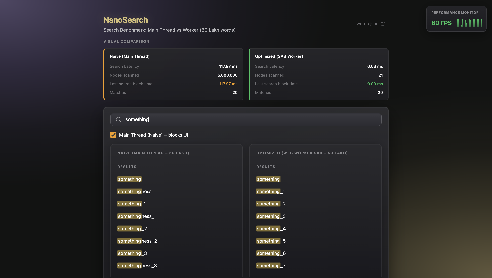

# NanoSearch

Search Benchmark: Main Thread vs Worker (50 Lakh words)

**[Live Demo](https://nanosearches.web.app/)** · [Source Code](https://github.com/ashishcumar/nanosearch)



NanoSearch compares search performance between **Naive (main-thread)** and **Optimized (Web Worker SAB)** implementations over 5 million words. It demonstrates how offloading search to a SharedArrayBuffer-backed Web Worker avoids UI blocking and achieves dramatically lower latency.

## Features

- **Main Thread (Naive)** – Linear search on 50 Lakh words, blocks UI
- **Optimized (SAB Worker)** – Binary search over SharedArrayBuffer, non-blocking
- **Visual comparison** – Side-by-side latency, nodes scanned, and match counts
- **Performance monitor** – Real-time FPS overlay

## Quick Start

```bash
npm install
npm run dev
```

Open http://localhost:5173 in **Chrome or Edge** (SharedArrayBuffer requires COOP/COEP headers; Vite dev server provides them).

## Setup 50 Lakh Dataset

If the full dataset isn't present, build it:

```bash
npm run build:5m    # Expands 466k → 50 Lakh words + builds sab-data.bin
```

Or step-by-step:

```bash
npm run expand:words   # Creates words-5m.txt, words-5m.json
npm run build:sab      # Creates sab-data.bin (Heap + Index)
```

## COOP/COEP Headers (SharedArrayBuffer)

SharedArrayBuffer requires these HTTP headers (Spectre/Meltdown mitigation):

- `Cross-Origin-Opener-Policy: same-origin`
- `Cross-Origin-Embedder-Policy: require-corp`

**Vite dev/preview** – Already configured in `vite.config.ts`.

**Production** – Configure your server (e.g. `vercel.json` for Vercel, `_headers` for Netlify).

## Tech Stack

- React + TypeScript + Vite
- Web Workers + SharedArrayBuffer
- Binary search over indexed heap (O(log n) prefix search)
